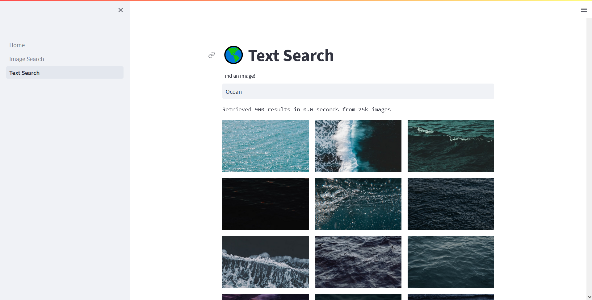

# Semantic Search

A super simple semantic search application, built for fun. Supports searching via text queries and via image similarity.

Search works by comparing the similarity between text/image and the images in the dataset.

## Dataset

We use the [Unsplash Lite](https://github.com/unsplash/datasets) dataset which consists of 25k images. The dataset size limits the quality of results to an extent, though the app should scale well.

## Features

We use CLIP embeddings for text and image - which both lie on a shared space, due to which we can compare both modalities directly.

## Retrieval

To ensure quick retrieval, we use approximate nearest neighbour search (specifically [Spotify's Annoy](https://github.com/spotify/annoy)) a fast approximation of nearest neighbour search.

# Some Fun Resources

- [https://github.com/rom1504/awesome-semantic-search](https://github.com/rom1504/awesome-semantic-search)
- [https://matsui528.github.io/cvpr2020_tutorial_retrieval/](https://matsui528.github.io/cvpr2020_tutorial_retrieval/)